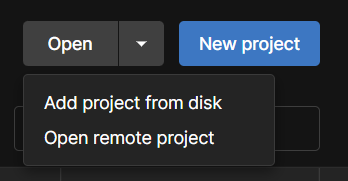
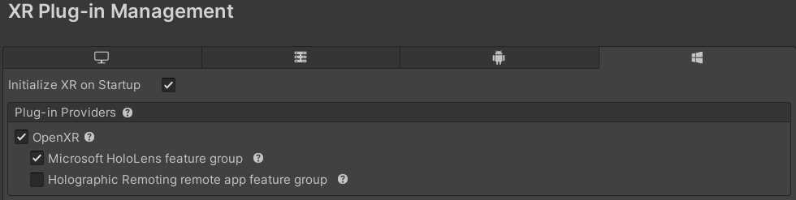
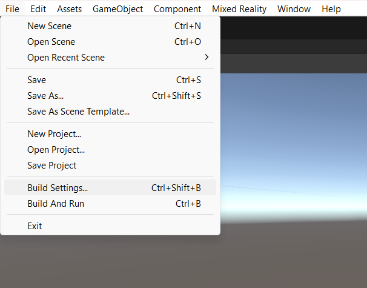
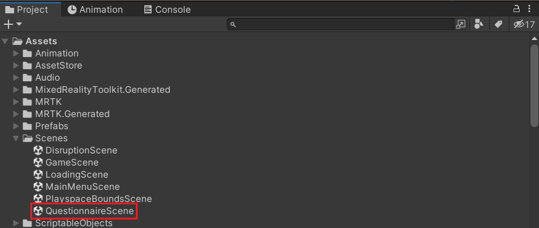
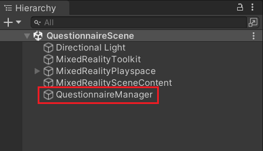
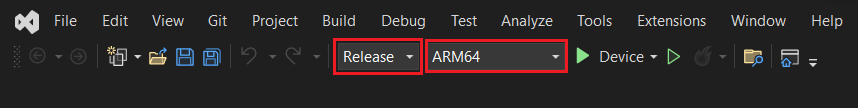
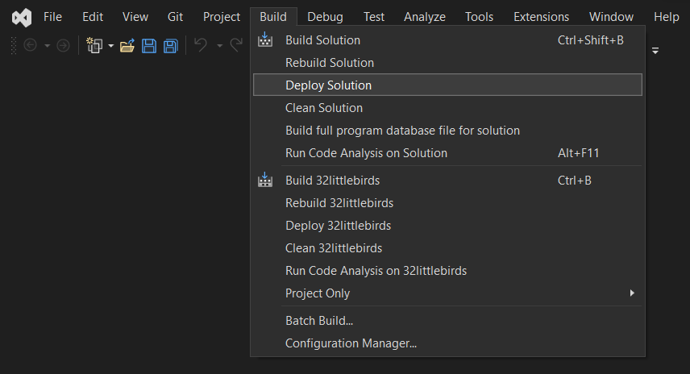

# 32-little-birds

Bachelor graduation project of Tygo Dijkgraaf

First time setup
================

-   Acquire the project zip
    (<https://github.com/visualisationlab/32-little-birds>)

-   Extract the folder to a convienent location

-   Download and open the Unity Hub

-   Click the arrow next to 'Open' and 'Add project from disk'\
    

-   Select the folder containing the project

-   Click the 'Missing Editor Version' warning if it is there

-   Install Unity Editor version 2021.3.16f1

-   Under 'Add modules', select 'Universal Windows Platform' and
    install.

-   Download and install Microsoft Visual Studio 2022 and make sure to
    add the following features during installation:

    -   .NET desktop development

    -   Desktop development with C++

    -   Universal Windows Platform (UWP) development

    -   Game development with Unity

-   Open the project in Unity

-   The following steps should not be necessary, but it is important to
    make sure the proper settings are applied:

    -   When presented with the MRTK Project Configurator, press 'Unity
        OpenXR plugin (recommended)'

    -   Press 'Show XR Plug-in Management Settings'

    -   Press the Windows icon and verify that 'Initialize XR on
        Startup', 'OpenXR' and 'Microsoft HoloLens feature group' are
        selected\
        

    -   Press 'Apply settings'. If it does not appear, press 'Skip This
        Step'

    -   Press 'Next' and 'Done'

    -   On the top left of the window, press 'File' and select 'Build
        Settings\...'\
        

    -   Ensure that the following scenes are all present in the 'Scenes
        in Build' section:

        1.  MainMenuScene

        2.  PlayspaceBoundsScene

        3.  GameScene

        4.  DisruptionScene

        5.  QuestionnaireScene

        6.  LoadingScene

    -   If any scene is not present, add them by navigating to the
        Assets/Scenes folder in the project and dragging them onto the
        window

-   Press 'Universal Windows Platform'

-   Make sure the following settings are active:

    1.  **Architecture:** ARM 64-bit

    2.  **Build Type:** D3D Project

    3.  **Target SDK Version:** Latest installed

    4.  **Minimum Platform Version:** 10.0.10240.0

    5.  **Visual Studio Version:** Latest installed

    6.  **Build and Run on:** Local Machine

    7.  **Build configuration:** Release

-   Press 'Switch Platform'

Changing questionnaire questions
================================

-   In the project, navigate to Assets/Scenes/QuestionnaireScene\
    

-   In the hierarchy, find and click the 'QuestionnaireManager'\
    

-   In the inspector, open the 'Questions' tab

-   Press the plus button to add questions and answers

Developer mode
==============

To build and deploy the application to the HoloLens, both the HoloLens
itself and the computer from which the application is deployed need to
be in developer mode.

-   On both the computer and the HoloLens, navigate to Settings $>$
    Update & Security $>$ For Developers

-   Enable 'Developer Mode'

-   On the HoloLens, also enable 'Device Portal'

Building and deploying to the HoloLens
======================================

-   Open the Build Settings and press 'Build'

-   Store the build in a folder called 'Builds'

-   Unity will start the build process

-   Once it is finished, open the generated Visual Studio solution

-   At the top of the window, select 'Release' and 'ARM64'\
    

-   With the HoloLens connected to the computer, press 'Build' and
    'Deploy Solution'\
    

If this is the first time you are deploying to the HoloLens, you will be
prompted for a PIN. In the developer settings of the HoloLens, press
'Pair' and enter the PIN that appears on the Hololens.

Extracting data
===============

-   Make sure the HoloLens and the computer are connected to the same
    Wi-Fi network

-   In the HoloLens, navigate to Settings $>$ Network & Internet $>$
    Wi-Fi and scroll to the bottom

-   Press 'Adapter Properties'

-   Find the IPv4 address and type into a browser

-   Log in with the username/password of the HoloLens. If it needs to be
    reset, it can be done in the following way:

    -   Type into the browser
        '\[HOLOLENS\_IPv4\_ADDRESS\]/devicepair.htm'

    -   Press 'Request PIN'

    -   Use the PIN displayed in the HoloLens to reset the
        username/password

-   Navigate to System $>$ File Explorer and press LocalAppData $>$
    32littlebirds $>$ LocalState

-   From here 'answers.csv' can be downloaded or deleted
